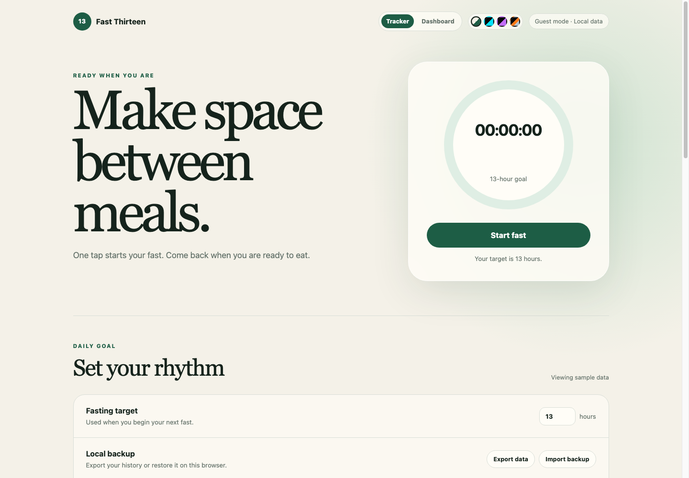
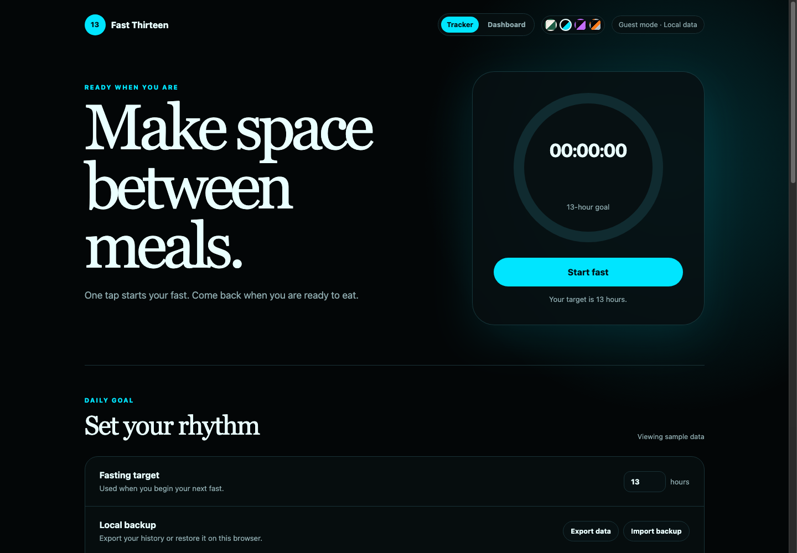
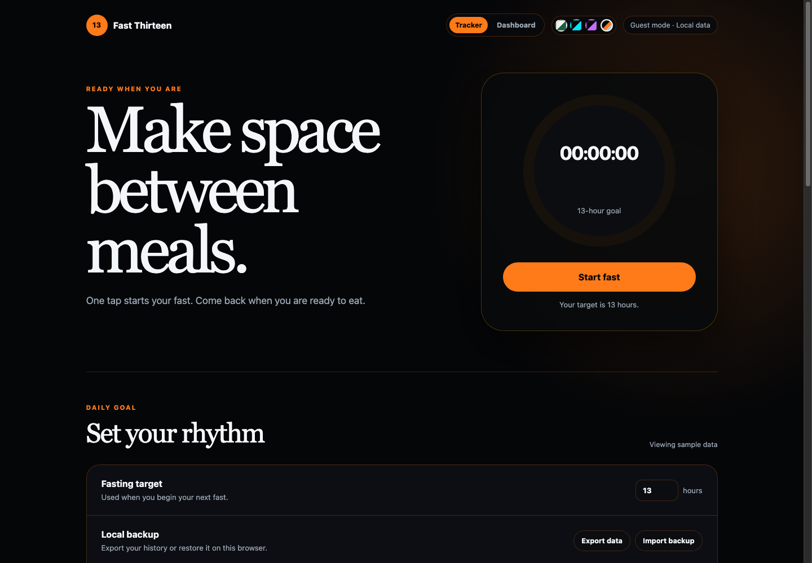

# Fast Thirteen

A focused fasting tracker built around one simple daily goal: fast for at
least 13 hours.

The first milestone is a dependency-free web MVP. It can start and end a fast,
store sessions in the browser, and summarize progress. The domain logic is
kept separate so it can later be shared conceptually with iPhone, Mac, and
Apple Watch clients.

## Try The Live UI

Experience the current Fast Thirteen UI on GitHub Pages:
[Launch the live sample](https://disbitski.github.io/fast-thirteen/).

The live version uses sample fasting data so you can explore the tracker, the
analytics dashboard, the 7/30/90/1Y trend controls, and the theme picker
without running anything locally.

| Light | Black/Cyan | SpaceX |
| --- | --- | --- |
|  |  |  |

## Why I Built This

I have been practicing daily fasting for more than 10 years. For me, fasting
is part of a larger philosophy around daily habits: strong body, strong mind,
disciplined soul.

Fast Thirteen started as a simple personal tool to help me stay consistent
with a 13-hour daily fasting rhythm. I wanted something clean, focused, and
motivating. No noise, no shame, no complicated setup. Just start the fast, end
the fast, and watch the habit compound over time.

I am building this in public because I want to give it to others for free and
help people make progress with their own fasting journey.

You can follow more of my training, discipline, and daily habit work on
Instagram: [@thedavedev](https://www.instagram.com/thedavedev/).

## Features

- Start and end a fast with one button
- Live elapsed-time display
- Clear active-state styling and a live running-fast history row
- 13-hour target progress
- Completed-fast count, total hours, and current streak
- Separate analytics dashboard with weekly charts and fasting insights
- Recent-session history
- Completed-session details with timestamp correction and confirmed deletion
- Browser-local persistence
- Guest mode and local data sync status foundations
- Optional Google sign-in scaffold that stays disabled without Supabase config
- Persistent light, black/cyan, black/purple, and SpaceX themes
- Configurable fasting goals captured per session
- Versioned local data with migration from the original storage format
- JSON backup export and restore

## Run Locally

```sh
npm start
```

Open [http://localhost:4173](http://localhost:4173).

The local server disables browser caching so the current app code is always
used after a reload.

Run the domain tests:

```sh
npm test
```

## Local Data

Fast Thirteen stores active and completed fasts in a local file on the Mac
running the server, with browser storage as a fallback. Closing the tab,
restarting the browser, restarting the local server, or switching between the
localhost and LAN URLs will not remove that data.

The local data format is sync-ready: sessions carry `updatedAt` and `deletedAt`
fields, backups include guest profile metadata, and sync status is tracked even
while the app remains local-only.

Other devices on the same network can use the Mac's LAN URL while the server
is running. They will share the same fasting history.

Use **Export data** periodically to create a JSON backup. Browser storage can
still be lost if site data is manually cleared or the browser profile is
removed.

## Supabase Foundation

Schema and row-level-security planning lives in
[`docs/supabase-foundation.md`](docs/supabase-foundation.md). The committed
`.env.example` contains placeholders only; real OAuth secrets, service-role
keys, and Apple signing material must stay outside Git.

The local server exposes `/config.js` with only browser-publishable Supabase
values: `SUPABASE_URL` and `SUPABASE_ANON_KEY`. If either value is missing,
authentication is disabled and local-only tracking continues to work.

Google OAuth setup readiness lives in
[`docs/google-oauth-readiness.md`](docs/google-oauth-readiness.md). It documents
the Supabase and Google Cloud steps without committing credentials.

Guest migration dry-run planning lives in
[`docs/guest-migration-dry-run.md`](docs/guest-migration-dry-run.md). It
describes how local history will be validated, backed up, deduplicated, and
previewed before any future cloud writes happen.

## Roadmap

- Reminders and target-reached notifications
- Personal analytics dashboard with weekly and monthly fasting trends
- Authentication and cloud synchronization
- SwiftUI apps for iPhone, Mac, and Apple Watch
- Widgets, complications, and target-reached notifications

## Health Note

Fast Thirteen is a personal tracking tool, not medical advice. Fasting is not
appropriate for everyone; consult a qualified healthcare professional when
needed.
